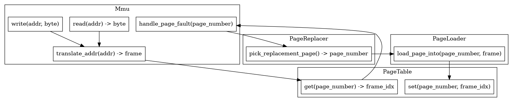

# Subsistema de Memória Virtual

Projeto B1 para a disciplina de Sistemas Operacionais, UFABC 2023.1 com o
brabíssimo JM Josko.

- Nome: Eduardo Renesto Estanquiere
- RA: 11201810086

## Arquitetura

Quando estou implementando algo pela primeira vez, gosto de ir "mão na massa"
direto, e depois numa segunda implementação então começar do zero com uma
arquitetura. O código deste repositório é a primeira implementação (por questões
de tempo e outras disciplinas), então a arquitetura foi polida depois da
implementação ter se iniciado.

De qualquer maneira, há uma visão bem geral de como o código funciona no arquivo
`docs/arquitetura.dot.png`:



Para entender melhor o funcionamento, sugiro *fortemente* que leia os
comentários[^1] nos arquivos de código.

[^1]: Por favor, leia mesmo! Gastei um bom tempo as escrevendo :')

O código é divido em duas `crates`: `project-demo` e `vm`. A primeira contém o
ponto de entrada e o código que lê e interpreta o arquivo com o conteúdo das
páginas. A segunda é mais interessante - contém a implementação propriamente
dita da estrutura da `MMU` e toda a lógica de memória virtual.

Os arquivos mais interessantes são:

- `project-demo/src/file_page_loader.rs`: contém o parser do arquivo de "swap";
- `vm/src/mmu.rs`: contém a implementação da MMU; (o arquivo mais importante!)
- `vm/page_replacer.rs`: contém a implementação dos algoritmos de substituição
  de páginas.

De qualquer modo, sugiro que leia *todos* os arquivos.

## Executando

O projeto foi escrito em Rust, então para executar será necessário um toolchain
relativamente novo. A maneira recomendada de se instalar Rust é usando o [rustup.rs](https://rustup.rs).

Tendo uma toolchain instalada, para executar basta entrar na pasta do projeto e
chamar:

```
$ cargo run
```

O programa ficará esperando a entrada na entrada padrão. O formato de entrada é
descrito no arquivo `project-demo/src/main.rs` nos comentários do módulo. Um
arquivo de exemplo de entrada pode ser encontrado na raiz do projeto em
`sample.in`, o qual pode ser usado com `cargo run < sample.in`.

## Swapfile

O projeto lê as páginas de um arquivo binário (descrito em
`project-demo/src/file_page_loader.rs`). **Por questões de tempo deixei o nome
do arquivo hardcoded no código, portanto não remova o arquivo `swapfile.bin` nem
execute o programa de outra pasta sem tal arquivo.** 

Já que não é um arquivo de texto, fica um pouco desconfortável escrever dados
manualmente nele. Por isso, existem algumas maneiras de o manipular:

1. Utilizando `python` para manualmente escrever os bytes;
2. Modificando o arquivo `generate_test_file.c` para escrever os dados e os
   índices;
3. Utilizando o próprio projeto para manipular o arquivo.

Este projeto implementa o `flushing` das páginas, isto é, elas podem ser
escritas e o arquivo será atualizado quando suas flags `dirty` estão
habilitadas. Então, um "cheat" para modificar o arquivo é o seguinte:

1. No arquivo `project-demo/src/main.rs`, comente a declaração da variável `mmu`
   e descomente a linha relevante, mencionada no próprio arquivo. Isso irá
   configurar o projeto com 256 bytes de memória e apenas 1 frame, o que irá
   causar page replacement em todo acesso a página diferente.
2. Utilize a linha de comando do projeto para escrever os dados desejados numa
   página (byte-a-byte), e depois execute uma leitura numa página diferente para
   causar o *flushing* da página original de volta ao arquivo.
